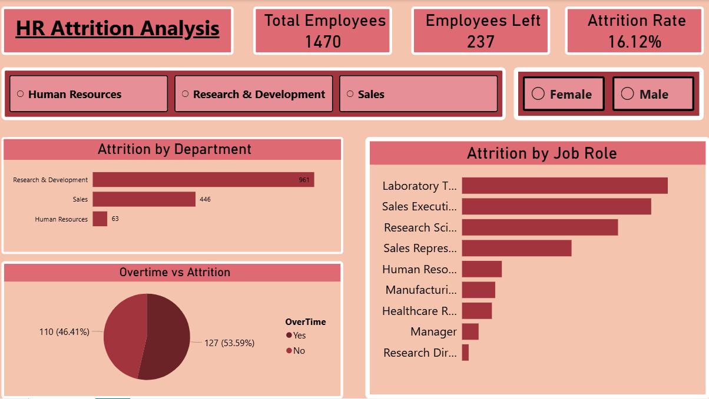

# HR Attrition Analysis Dashboard | Power BI

## Project Overview
This project focuses on analyzing employee attrition using an interactive *Power BI dashboard*.  
The goal is to identify attrition patterns across departments, job roles, gender, and overtime, and to present key HR insights in a clear and business-friendly format.

The dashboard is built using *basic Power BI measures* and standard data modeling techniques.

## Tools & Technologies
- Power BI Desktop  
- DAX (Basic Measures)  
- Microsoft Excel  
- Git & GitHub  

## Data Preparation
The dataset was cleaned and prepared using Power BI and Excel:
- Checked for missing and inconsistent values  
- Standardized department and job role names  
- Ensured correct data types for measures and calculations  

## DAX Measures Used
Basic DAX measures were created to calculate:
- Total Employees  
- Employees Left  
- Attrition Rate (%)  

(Only simple aggregation and percentage measures were used in this project.)

## Dashboard Highlights

### KPI Cards
- *Total Employees*
- *Employees Left*
- *Attrition Rate (%)*

### Slicers
- Department (Human Resources, Research & Development, Sales)
- Gender (Male, Female)

### Visual Analysis
- *Attrition by Department* – Identifies departments with higher attrition
- *Attrition by Job Role* – Highlights roles most affected by attrition
- *Overtime vs Attrition* – Compares attrition trends based on overtime status

## Key Insights
- Sales department shows the highest attrition rate
- Attrition is notably higher among certain job roles such as Sales Executive
- Employees working overtime show higher attrition compared to those who do not
- Gender-based filtering provides additional insight into attrition patterns

## Files Included
- HR_Attrition_Analysis.pbix – Power BI dashboard file  
- hr_analytics_data.xlsx / .csv – Dataset used for analysis  
- README.md – Project documentation  

# HR Attrition Analysis Dashboard | Power BI

## Project Overview
This project focuses on analyzing employee attrition using an interactive *Power BI dashboard*.  
The goal is to identify attrition patterns across departments, job roles, gender, and overtime, and to present key HR insights in a clear and business-friendly format.

The dashboard is built using *basic Power BI measures* and standard data modeling techniques.

---

## Tools & Technologies
- Power BI Desktop  
- DAX (Basic Measures)  
- Microsoft Excel  
- Git & GitHub  

---

## Dataset Details
- *Dataset Type:* HR Analytics Dataset  
- *Source:* Public HR Attrition dataset (commonly used for analytics practice)  
- *Granularity:* Employee-level data  

---

## Data Preparation
The dataset was cleaned and prepared using Power BI and Excel:
- Checked for missing and inconsistent values  
- Standardized department and job role names  
- Ensured correct data types for measures and calculations  

---

## DAX Measures Used
Basic DAX measures were created to calculate:
- Total Employees  
- Employees Left  
- Attrition Rate (%)  

(Only simple aggregation and percentage measures were used in this project.)

---

## Dashboard Highlights

### KPI Cards
- *Total Employees*
- *Employees Left*
- *Attrition Rate (%)*

### Slicers
- Department (Human Resources, Research & Development, Sales)
- Gender (Male, Female)

### Visual Analysis
- *Attrition by Department* – Identifies departments with higher attrition
- *Attrition by Job Role* – Highlights roles most affected by attrition
- *Overtime vs Attrition* – Compares attrition trends based on overtime status

## Key Insights
- Sales department shows the highest attrition rate
- Attrition is notably higher among certain job roles such as Sales Executive
- Employees working overtime show higher attrition compared to those who do not
- Gender-based filtering provides additional insight into attrition patterns

## Files Included
- HR_Attrition_Analysis.pbix – Power BI dashboard file  
- hr_analytics_data.xlsx / .csv – Dataset used for analysis  
- README.md – Project documentation  

## How to Use This Project
1. Download the .pbix file from the repository  
2. Open it using *Power BI Desktop*  
3. Refresh data if required  
4. Use slicers to explore attrition insights interactively  

## Dashboard Preview

## How to Use This Project
1. Download the .pbix file from the repository  
2. Open it using *Power BI Desktop*  
3. Refresh data if required  
4. Use slicers to explore attrition insights interactively  

## Disclaimer
This project is created for *learning, practice, and portfolio purposes only*.  
The dataset is publicly available and does not represent real organizational data.
